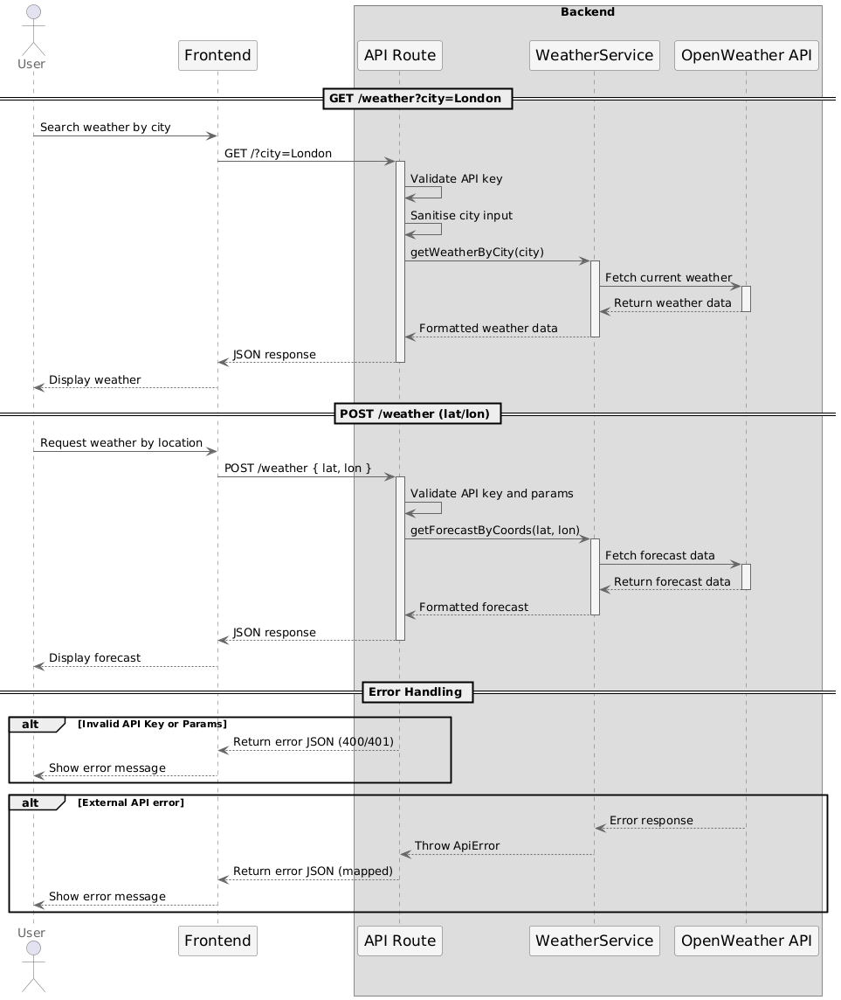
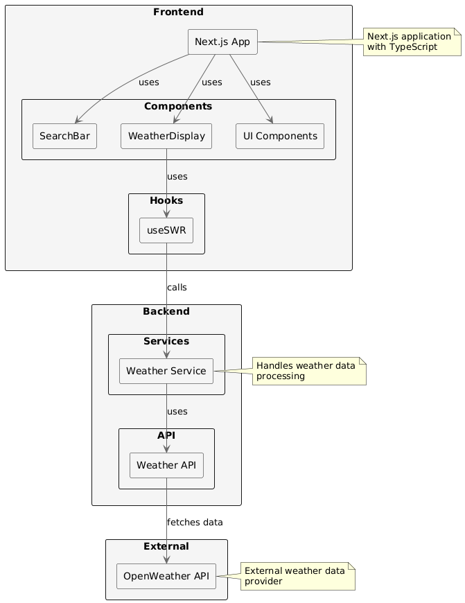

# Weather App

Weather application built with Next.js that provides real-time weather information using Open Weather API

## Features

- Real-time weather data
- Search weather by city
- Forecast weekly weather

## Tech Stack

- [Next.js](https://nextjs.org/) - React framework
- [TypeScript](https://www.typescriptlang.org/) - Type safety
- [Tailwind CSS](https://tailwindcss.com/) - Styling
- [SWR](https://swr.vercel.app/) - Data fetching
- [Radix UI](https://www.radix-ui.com/) - UI components
- [Vitest](https://vitest.dev/) - Testing

## Getting Started

### Installation

1. Clone the repository:

```bash
git clone https://github.com/paulinavita/weathering.git
cd weathering
```

2. Install dependencies:

```bash
pnpm install
```

3. Create a `.env` file in the root directory and add your weather API key:

```bash
OPEN_WEATHER_API_KEY=your_api_key_here
```

4. Start the development server:

```bash
pnpm dev
```

5. Running the application

```bash
Open [http://localhost:3000](http://localhost:3000) with your browser to see the result.
```

## Project Structure

```
├── src/              # Source files
├── public/           # Static files
├── __test__/        # Test files
├── components/       # React components
└── ...
```

## Test

To run test you can run from the terminal

```bash
pnpm test
```

## UML Diagram

Sequence Diagram


Architecture

